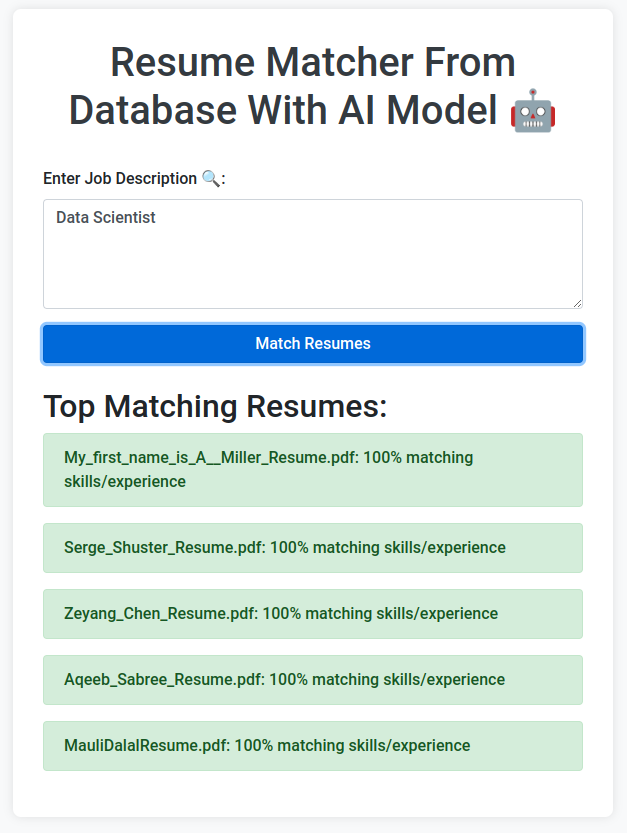

# **Train Model to Get Match Resumes from Database**



This repository contains code and data for training a machine learning model to match resumes from a database. The goal is to develop a model that can accurately identify and match candidate resumes to job descriptions or other specified criteria.

## **Repository Structure**

- **`data/`**: Contains the datasets used for training and testing the resume matching model, including the `title.png` image.
- **`env/`**: Environment configuration and dependencies for the project.
- **`models/`**: Stores the machine learning models and model weights after training.
- **`notebooks/`**: Jupyter notebooks for experiments, data exploration, and model development.
- **`templates/`**: HTML templates for visualization or reporting purposes.
- **`.gitignore`**: Specifies which files and directories to ignore in version control.
- **`README.md`**: Provides an overview and setup instructions for the project.
- **`app.py`**: Main application script that runs the resume matching pipeline.
- **`requirements.txt`**: Lists the dependencies and libraries required for the project.

## **Getting Started**

### **1. Clone the Repository**
```bash
git clone git@github.com:mrizwanakram/Train-model-to-get-Match-Resumes-from-Database.git
cd Train-model-to-get-Match-Resumes-from-Database
```

### **2. Set Up Virtual Environment (Optional)**
Create a virtual environment to keep your dependencies isolated.
```bash
python -m venv env
source env/bin/activate  # For Windows: env\Scripts\activate
```

### **3. Install Dependencies**
Install the necessary Python packages listed in `requirements.txt`:
```bash
pip install -r requirements.txt
```

### **4. Run the Application**
Once everything is set up, you can run the application:
```bash
python app.py
```

This script will load the data, preprocess it, train the model, and output the resume matches.

## **Usage**

### **1. Data Preprocessing**
Run the data preprocessing script to prepare the resume and job data:
```bash
python scripts/preprocess_data.py
```

### **2. Train the Model**
To train the machine learning model for matching resumes:
```bash
python scripts/train_model.py
```

### **3. Predict Resume Matches**
Use the trained model to predict resume matches:
```bash
python scripts/predict.py --input <resume_data.csv> --output <matched_results.csv>
```

## **Contributing**

Contributions are welcome! Please open an issue or submit a pull request with any enhancements, bug fixes, or improvements.

## **License**

This project is licensed under the MIT License. See the [LICENSE](LICENSE) file for more information.